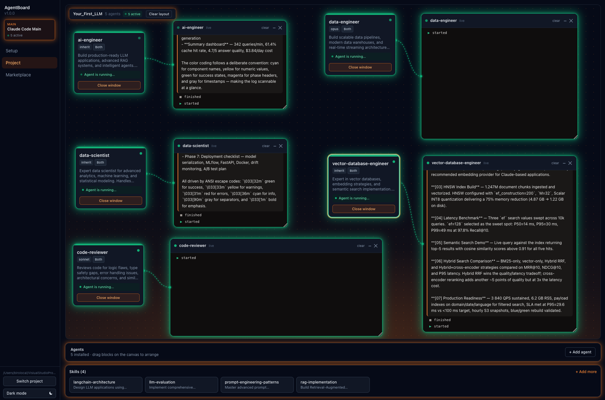
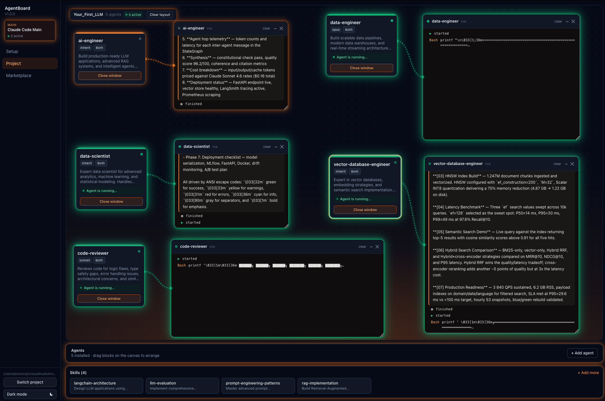

# AgentBoard

**Setup and monitor Claude Code agents — all from a single desktop app.**



AgentBoard is an Electron desktop app that gives [Claude Code](https://claude.ai/code) a visual control panel. Discover and install agents from the [wshobson/agents](https://github.com/wshobson/agents) marketplace with one click, then watch them run in real time on a draggable canvas — with per-agent terminal windows showing live tool calls and activity.

No config files to edit. No terminal tab sprawl. Clone it, drop it in your project, run it.

> **AgentBoard never proxies the LLM.** Claude Code talks directly to Anthropic. AgentBoard is a config + observability layer only.

---

## Why AgentBoard?

Claude Code is powerful but its surface area lives in scattered files: `.claude/agents/*.md`, `.claude/skills/`, `CLAUDE.md`, `settings.json`. Setting up a new project means copying boilerplate, editing markdown by hand, and remembering which agent does what.

AgentBoard solves three problems:

1. **Setup friction** — A new project should take 60 seconds, not 30 minutes of file shuffling
2. **Discovery** — 126 unique agents in the marketplace is too many to track manually; a visual catalog with search makes it instant
3. **Observability** — No built-in way to see which agent is running, what tool it just called, when it finished. AgentBoard shows this live.

---

## Features

- **Agent marketplace** — browse 126 curated agents sourced from [wshobson/agents](https://github.com/wshobson/agents), install to any project in one click
- **Live canvas** — all your agents on a draggable canvas with real-time running / idle / waiting status badges
- **Per-agent terminals** — open a terminal window per agent and watch tool calls, start/stop events, and last assistant message as they happen
- **Multi-project support** — one AgentBoard install, any number of projects; each project keeps its own isolated `.claude/` config
- **Project picker** — switch between projects from the GUI, no terminal commands required
- **CLAUDE.md policy system** — built on patterns from [forrestchang/andrej-karpathy-skills](https://github.com/forrestchang/andrej-karpathy-skills)



---

## Quick Start

**Prerequisites:** Node 20+, [Claude Code](https://claude.ai/code) installed

```bash
git clone https://github.com/birol91/agent-board.git
cd agent-board
npm install
npm run dev
```

AgentBoard opens. Use the project picker to select any project folder on your machine. AgentBoard reads and writes that project's `.claude/` directory and auto-installs hook listeners so the canvas updates in real time.

> `dist/` and `node_modules/` are not committed. Run `npm install` after cloning.

---

## How It Works

```
Your Project/
└── .claude/
    ├── agents/          ← AgentBoard installs marketplace agents here
    ├── skills/          ← AgentBoard installs skills here
    ├── hooks/           ← AgentBoard auto-installs Claude Code hooks here
    ├── settings.json
    └── agent-board.json ← canvas layout (positions, open terminals)
```

1. **Pick a project** — GUI picker selects any folder; each project's config is fully isolated
2. **Install agents** — browse the marketplace, click Install; the `.md` file lands in `.claude/agents/`
3. **Watch them run** — Claude Code fires hook events over a Unix socket; canvas and terminals update live
4. **Switch projects** — hit "Switch project" in the sidebar; nothing leaks between projects

---

## Project Isolation

Every project you open has its own `.claude/` directory. Agents you install, skills you enable, canvas layout, and hook config are all scoped to that project. Opening five different projects in AgentBoard means five completely independent configurations.

---

## Built On

| Project | What it contributes |
|---|---|
| [wshobson/agents](https://github.com/wshobson/agents) | Agent marketplace — 184 agent definitions, deduplicated to 126 unique entries |
| [forrestchang/andrej-karpathy-skills](https://github.com/forrestchang/andrej-karpathy-skills) | `CLAUDE.md` policy patterns used as the coding-behavior foundation |

---

## Tech Stack

| Layer | Choice |
|---|---|
| Desktop runtime | Electron 30 |
| UI | React 18 + TypeScript |
| Styling | Tailwind CSS 3.4 |
| State | Zustand |
| Bundler | Vite |
| Hook events | Unix socket (`/tmp/agent-board.sock`) |

---

## Roadmap

- [ ] Per-agent transcript tailing — thinking blocks and intermediate messages in terminals
- [ ] Memory editor UI — manage `.claude/memory/` from the GUI
- [ ] Agent system prompt editor — edit prompts inline without touching `.md` files
- [ ] Settings UI — project defaults, hook configuration
- [ ] Live agent-to-agent communication graph

---

## Contributing

Pull requests are welcome. For major changes, open an issue first.

```bash
npm run typecheck   # type-check all three tsconfigs (main / preload / renderer)
npm run build       # production build
```

---

## License

MIT — see [LICENSE](./LICENSE).
